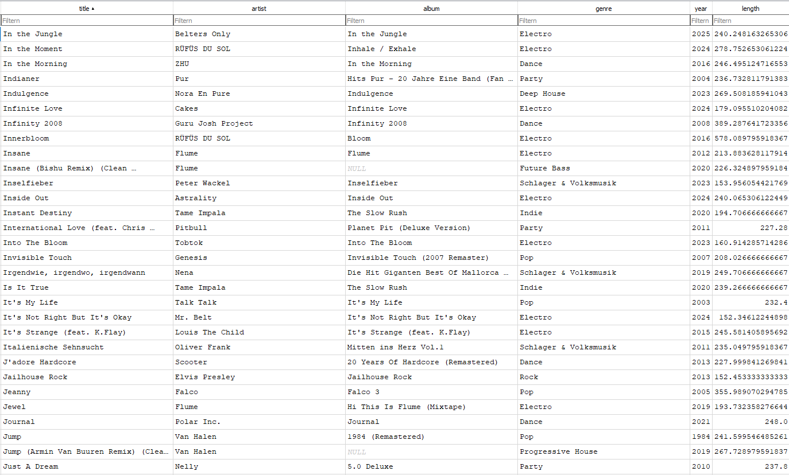

# Audio Analysis Projekt

## Projektübersicht

Dieses Projekt wurde als Lernprojekt erstellt, mit dem Ziel, praktische Erfahrungen im Umgang mit Datenbanken, Datenaufbereitung und Datenanalyse zu sammeln. Auch wenn schon Erfahrung aus dem Studium vorhanden ist, beruht diese eher auf theoretischer Natur und hat mit der Praxis zum Teil wenig zu tun.

---

## Datenerhebung

Die Datengrundlage dieses Projekts basiert auf einer persönlichen Musikbibliothek.

- Metadaten von ca. 900 Audiodateien wurden extrahiert
- Die extrahierten Daten wurden in einer Datenbank gespeichert
- Enthalten sind Informationen wie Künstler, Titel, Erscheinungsjahr und weitere Infos

Hier ist einmal ein Ausschnitt aus der Datenbank mit DB Browser abgebildet:

  

---

## Datenaufbereitung

Nach der Datenerhebung wurde eine Bereinigung und Aufbereitung der Daten durchgeführt.

Dazu gehören:

- Entfernen von fehlerhaften oder unvollständigen Einträgen
- Vereinheitlichung von Daten
- Vorbereitung der Daten für die Analyse

---

## Geplante Weiterentwicklung

Die vorhandene Datenbank dient als Grundlage für zukünftige Experimente im Bereich Datenanalyse und Machine Learning.

Geplante nächste Schritte:

- Einsatz von scikit-learn, um bekannte Verfahren im Machine-Learning zu verinnerlichen.
- Analyse von Mustern und Zusammenhängen innerhalb der Daten
