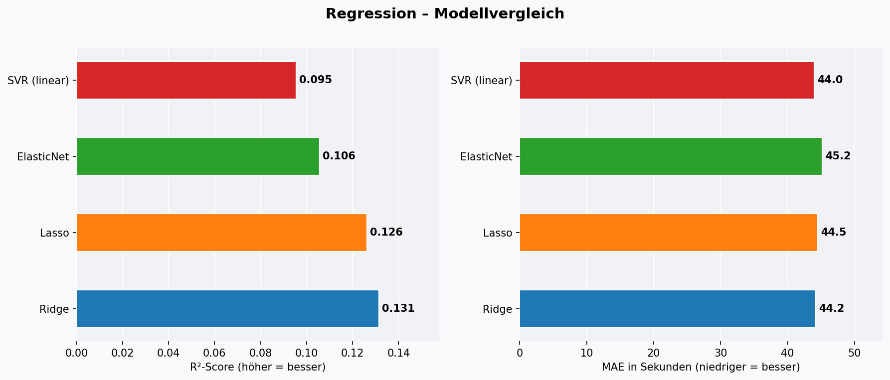
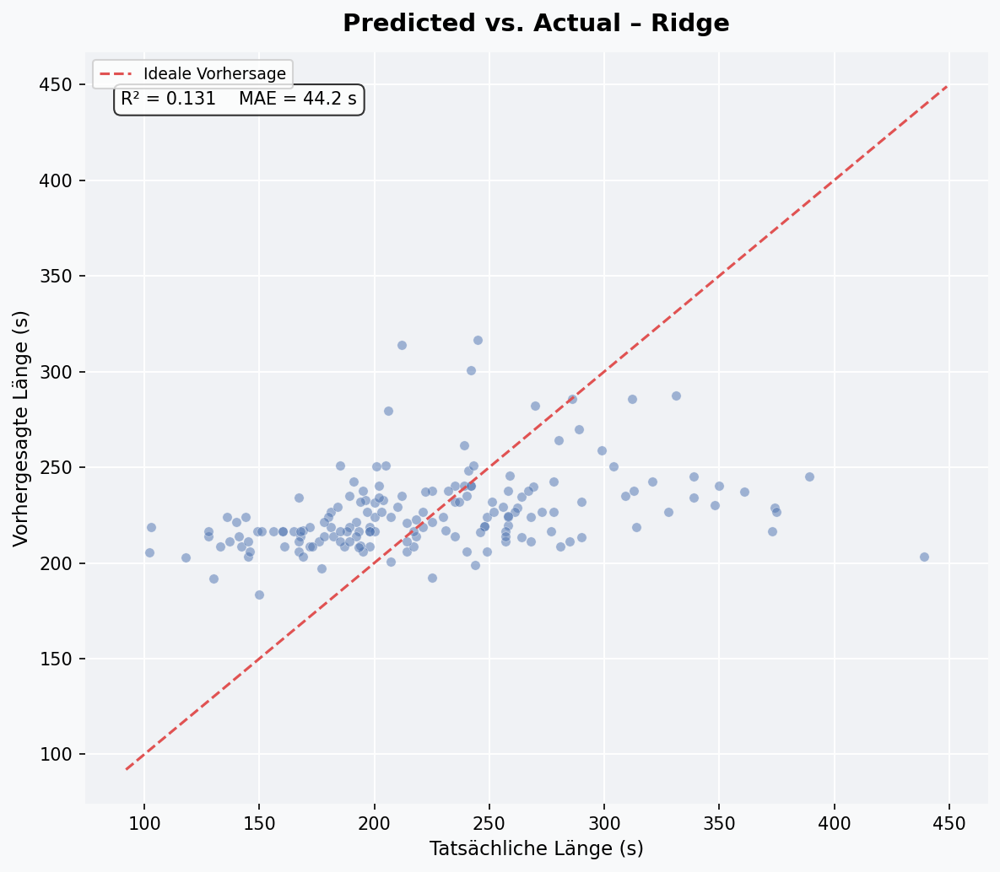
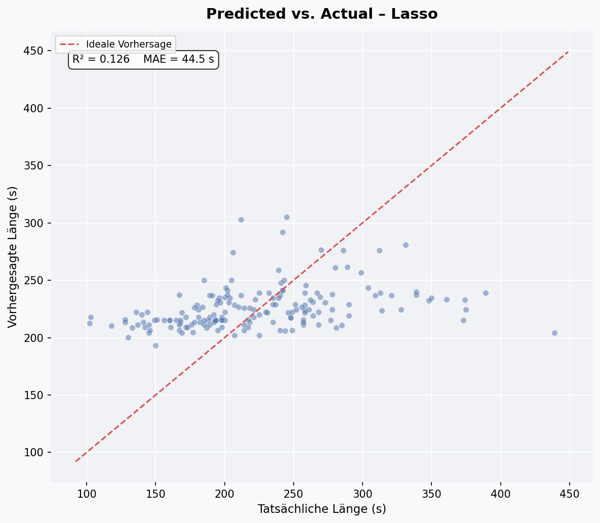
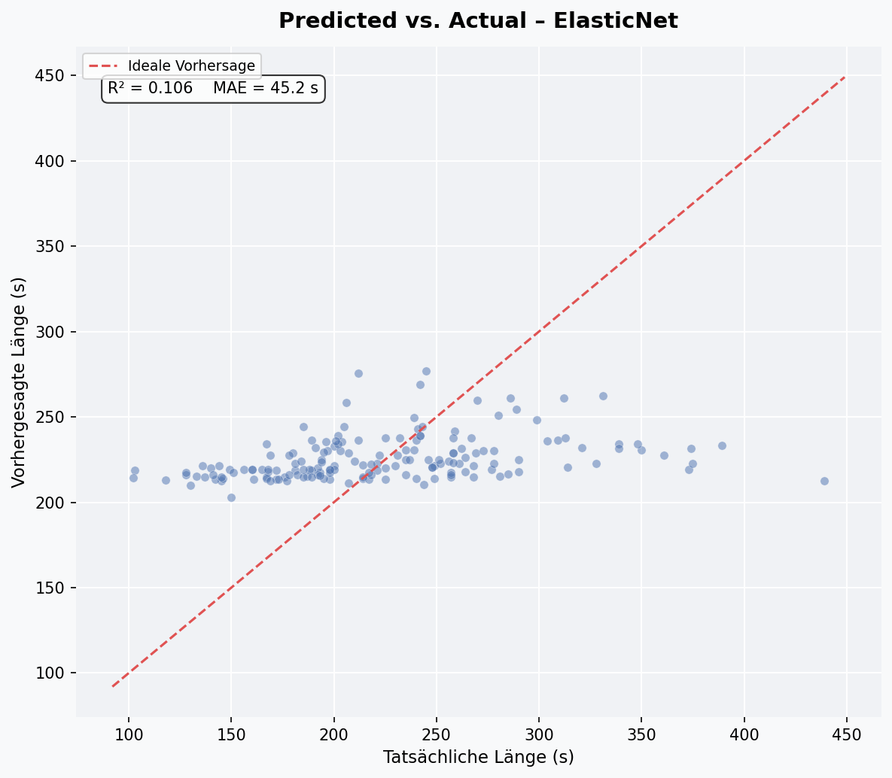
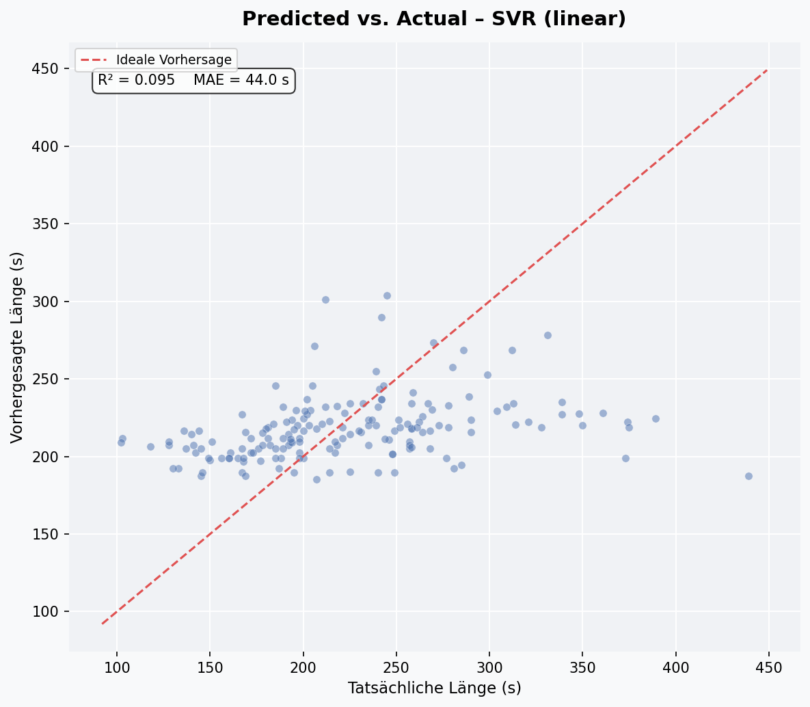

# Audio Analysis Projekt

## Projektübersicht

Dieses Projekt wurde als Lernprojekt erstellt, mit dem Ziel, praktische Erfahrungen im Umgang mit Datenbanken, Datenaufbereitung und Datenanalyse zu sammeln. Auch wenn schon Erfahrung aus dem Studium vorhanden ist, beruht diese eher auf theoretischer Natur und hat mit der Praxis zum Teil wenig zu tun.

---

## Datenerhebung

Die Datengrundlage dieses Projekts basiert auf einer persönlichen Musikbibliothek.

- Metadaten von ca. 900 Audiodateien wurden extrahiert
- Die extrahierten Daten wurden in einer Datenbank gespeichert
- Enthalten sind Informationen wie Künstler, Titel, Erscheinungsjahr und weitere Infos

Hier ist einmal ein Ausschnitt aus der Datenbank mit DB Browser abgebildet:

  

---

## Datenaufbereitung

Nach der Datenerhebung wurde eine Bereinigung und Aufbereitung der Daten durchgeführt.

Dazu gehören:

- Entfernen von fehlerhaften oder unvollständigen Einträgen
- Vereinheitlichung von Daten
- Vorbereitung der Daten für die Analyse

---

## Dimensionsreduktion

Bei der Dimensionsreduktion werden hochdimensionale Daten auf zwei Dimensionen projiziert, um sie visuell darstellen zu können. Jeder Punkt entspricht einem Song, die Farbe zeigt das Genre. Die Features für alle Methoden sind: Genre (One-Hot-kodiert), Erscheinungsjahr und Länge des Songs.

### PCA – Principal Component Analysis

PCA ist eine lineare Methode, die die Richtungen mit der größten Varianz in den Daten sucht und die Daten entlang dieser Achsen projiziert. Sie ist schnell, deterministisch und gut interpretierbar – zeigt jedoch nur lineare Strukturen.

  

---

### t-SNE – t-distributed Stochastic Neighbor Embedding

t-SNE ist eine nicht-lineare Methode, die darauf ausgelegt ist, lokale Nachbarschaftsstrukturen zu erhalten. Songs, die sich ähneln, landen nah beieinander. Das Ergebnis ist zufällig (kein deterministischer Algorithmus) und eignet sich besonders gut zur Visualisierung von Clustern – jedoch nicht für Distanzvergleiche zwischen Clustern.

  

---

### Isomap

Isomap erweitert MDS (Multidimensional Scaling) um geodätische Abstände: Statt gerader Linien durch den Raum werden Abstände entlang des Datengraphen berechnet. Damit eignet sich Isomap besonders für Daten, die auf gekrümmten Mannigfaltigkeiten liegen.

  

---

### Spectral Embedding

Spectral Embedding baut einen Ähnlichkeitsgraphen zwischen den Datenpunkten auf und berechnet daraus die Eigenvektoren der Laplace-Matrix. Es ist verwandt mit Spectral Clustering und eignet sich für nicht-konvexe, zusammenhängende Strukturen.

  

---

## Clustering

Beim Clustering werden Songs automatisch in Gruppen eingeteilt – ohne vorgegebene Labels. Als Eingabe dienen dieselben Features wie bei der Dimensionsreduktion (Genre, Jahr, Länge). Die Visualisierung erfolgt jeweils über eine PCA-Projektion auf 2D. Zur Bewertung der Clusterqualität wird der **Silhouette-Score** verwendet: Er misst, wie gut ein Punkt zu seinem eigenen Cluster passt im Vergleich zu den anderen Clustern. Werte nahe 1 sind ideal.

### KMeans

KMeans teilt die Daten in eine vorher festgelegte Anzahl von Clustern (hier k=7). Der Algorithmus minimiert iterativ die Abstände der Punkte zu ihrem jeweiligen Clusterzentrum. Er ist schnell und gut skalierbar, setzt aber sphärische, gleichgroße Cluster voraus.

**Silhouette-Score: 0.457**

  

---

### MeanShift

MeanShift benötigt keine vorgegebene Clusteranzahl. Der Algorithmus verschiebt iterativ Kernelpunkte in Richtung der lokalen Datendichte und findet so eigenständig die Anzahl der Cluster. Hier wurden automatisch **11 Cluster** erkannt.

**Silhouette-Score: 0.403**

  

---

### GMM – Gaussian Mixture Model

GMM geht davon aus, dass die Daten durch eine Überlagerung mehrerer Normalverteilungen (Gaussians) erzeugt wurden. Im Gegensatz zu KMeans weist GMM jedem Punkt keine harte Clusterzugehörigkeit zu, sondern eine Wahrscheinlichkeit. Das macht das Modell flexibler bei unterschiedlich geformten oder überlappenden Clustern.

**Silhouette-Score: 0.399**

  

---

### Spectral Clustering

Spectral Clustering baut zunächst einen Ähnlichkeitsgraphen zwischen den Datenpunkten auf und wendet anschließend Clustering auf die Eigenvektoren der Graph-Laplace-Matrix an. Es eignet sich besonders für nicht-konvex geformte Cluster, ist aber rechenintensiver als KMeans. Der niedrige Silhouette-Score zeigt, dass die Cluster hier weniger kompakt sind – was typisch für graphbasierte Methoden auf dieser Datenlage ist.

**Silhouette-Score: 0.102**

  

---

## Klassifikation

Ziel: Genre eines Songs aus **Erscheinungsjahr und Länge** vorhersagen. Die Daten wurden 80/20 in Trainings- und Testset aufgeteilt (stratifiziert nach Genre). Da die Klassen stark unbalanciert sind (Electronic: 339 Songs, Alternative: 9), wurden alle Modelle mit `class_weight="balanced"` trainiert.

> **Hinweis zu den Scores:** Der Macro F1 liegt bei allen Modellen zwischen 0.16 und 0.23 — das ist erwartet. Jahr und Länge allein reichen nicht aus, um Genre zuverlässig vorherzusagen. Die Modelle lernen vor allem Electronic und Pop (die dominanten Klassen). Der Wert liegt dabei, zu zeigen, was mit minimalen Features möglich ist — und wo die Grenzen der Daten liegen.

### Modellvergleich – Macro F1

  

---

### KNeighbors Classifier

KNN klassifiziert einen Punkt anhand der k nächsten Nachbarn im Feature-Raum. Hier k=7. Der Algorithmus ist nicht-parametrisch und einfach zu verstehen, reagiert aber sensibel auf unbalancierte Klassen.

  

---

### Linear SVC

Der Linear Support Vector Classifier sucht eine lineare Trennhyperplane zwischen den Klassen. Er ist effizient und gut für hochdimensionale Räume geeignet. Mit nur zwei Features (Jahr, Länge) stößt er hier schnell an seine Grenzen.

  

---

### SVC (kernel='rbf')

Der SVC mit RBF-Kernel kann nicht-lineare Entscheidungsgrenzen lernen. Das macht ihn flexibler als den linearen SVC, führt aber bei wenigen Features nicht zwingend zu besseren Ergebnissen.

  

---

### Random Forest

Random Forest trainiert eine Vielzahl von Entscheidungsbäumen auf zufälligen Teilmengen der Daten und mittelt deren Vorhersagen. Zusätzlich zur Confusion Matrix liefert er Feature Importances — hier zeigt sich, welches der beiden Features (Jahr vs. Länge) mehr zur Klassifikation beiträgt.

  

  

---

## Regression

Ziel: Die **Länge eines Songs** aus Genre und Erscheinungsjahr vorhersagen. Die Features sind Jahr + Genre (One-Hot-kodiert), das Ziel ist die Länge in Sekunden (Mittelwert: 225s, Std: 61s). Bewertet wird mit **R²** (Anteil der erklärten Varianz) und **MAE** (mittlerer absoluter Fehler in Sekunden).

> **Hinweis zu den Scores:** Alle Modelle erzielen ein R² zwischen 0.10 und 0.13. Das bedeutet: Genre und Jahr erklären ca. 10–13 % der Varianz in der Songlänge. Das ist erwartbar — Songlänge hängt von vielen Faktoren ab, die in den Metadaten nicht enthalten sind (z.B. Instrumentierung, Albumkonzept, Label). Ein niedriger R² ist hier kein Fehler, sondern eine ehrliche Aussage über die Grenzen der Datenbasis.

### Modellvergleich – R² und MAE

  

---

### Ridge Regression

Ridge minimiert den quadratischen Fehler mit einer L2-Regularisierung, die große Koeffizienten bestraft. Dadurch bleibt das Modell stabil, auch wenn Features korreliert sind. Ridge erzielt hier das beste R² (0.131).

  

---

### Lasso

Lasso verwendet L1-Regularisierung, die nicht nur große Koeffizienten bestraft, sondern irrelevante Features komplett auf 0 setzt — also implizit Feature Selection betreibt. Das Ergebnis ist minimal schlechter als Ridge (R² = 0.126), was darauf hindeutet, dass die meisten Features hier tatsächlich relevant sind.

  

---

### ElasticNet

ElasticNet kombiniert L1- und L2-Regularisierung (hier 50/50). Es ist ein Kompromiss zwischen Ridge und Lasso — nützlich, wenn viele Features schwach korreliert sind. R² = 0.106.

  

---

### SVR (kernel='linear')

Der Support Vector Regressor mit linearem Kernel sucht eine Hyperplane, die möglichst viele Punkte innerhalb eines Toleranzbereichs (ε-Schlauch) trifft. Hier erzielt er R² = 0.095 bei gleichzeitig niedrigstem MAE (44.0s), was zeigt, dass er die Extremwerte besser ignoriert als die linearen Modelle.

  

