# Audio Analysis Projekt

## Projektübersicht

Dieses Projekt wurde als Lernprojekt erstellt, mit dem Ziel, praktische Erfahrungen im Umgang mit Datenbanken, Datenaufbereitung und Datenanalyse zu sammeln. Auch wenn schon Erfahrung aus dem Studium vorhanden ist, beruht diese eher auf theoretischer Natur und hat mit der Praxis zum Teil wenig zu tun.

---

## Datenerhebung

Die Datengrundlage dieses Projekts basiert auf einer persönlichen Musikbibliothek.

- Metadaten von ca. 900 Audiodateien wurden extrahiert
- Die extrahierten Daten wurden in einer Datenbank gespeichert
- Enthalten sind Informationen wie Künstler, Titel, Erscheinungsjahr und weitere Infos

Hier ist einmal ein Ausschnitt aus der Datenbank mit DB Browser abgebildet:

  

---

## Datenaufbereitung

Nach der Datenerhebung wurde eine Bereinigung und Aufbereitung der Daten durchgeführt.

Dazu gehören:

- Entfernen von fehlerhaften oder unvollständigen Einträgen
- Vereinheitlichung von Daten
- Vorbereitung der Daten für die Analyse

---

## Dimensionsreduktion

Bei der Dimensionsreduktion werden hochdimensionale Daten auf zwei Dimensionen projiziert, um sie visuell darstellen zu können. Jeder Punkt entspricht einem Song, die Farbe zeigt das Genre. Die Features für alle Methoden sind: Genre (One-Hot-kodiert), Erscheinungsjahr und Länge des Songs.

### Principal Component Analysis

PCA ist eine lineare Methode, die die Richtungen mit der größten Varianz in den Daten sucht und die Daten entlang dieser Achsen projiziert.

**Laufzeit: 0.01s**

Im Ergebnis bilden Electronic (blau), Dance (grün) und Pop (orange) jeweils klar erkennbare Streifen. Die kleineren Genres häufen sich dazwischen in der Mitte. Die diagonalen Linien entstehen dadurch, dass Songs innerhalb eines Genres sich nur in Jahr und Länge unterscheiden. Insgesamt zeigt die PCA gut, dass Genre der dominante Faktor ist, wobei die kleineren Genres aber verschwimmen.

  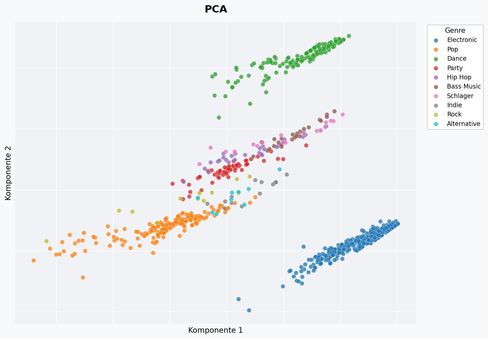

---

### t-SNE 

t-SNE ist darauf ausgelegt, lokale Nachbarschaftsstrukturen zu erhalten. Demnach landen Songs, die sich ähneln, nah beieinander. In diesem Projekt bringt diese Methode keine wirklich neuen Erkenntnisse, da einfach nach Genre geclustert wird. Immerhin werden die einzelnen Cluster gut visualisiert ¯\\_(ツ)_/¯

**Laufzeit: 5.07s**

  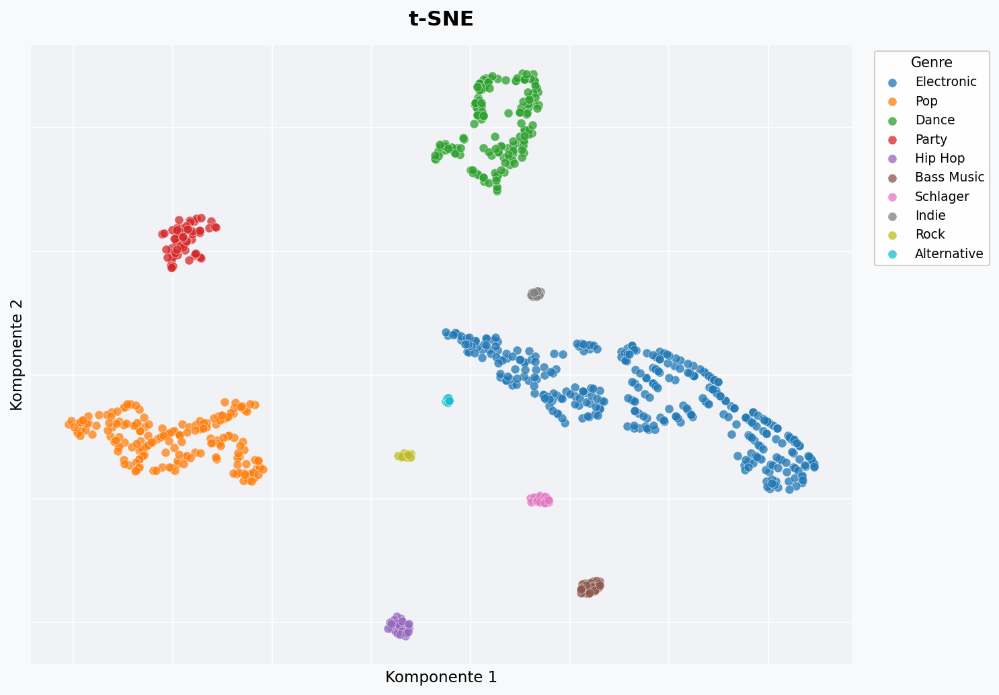

---

### Isomap

Bei der Isomap werden statt gerader Linien durch den Raum, die Abstände entlang des Datengraphen berechnet.

**Laufzeit: 0.37s**

Das Ergebnis ist das interpretierbarste der vier Methoden: Die Genres sind sauber voneinander getrennt und in klar erkennbaren Gruppen angeordnet. Besonders auffällig sind die fast perfekt geraden Linien innerhalb eines Genres. Das ist kein Zufall, sondern ein Artefakt des One-Hot-Encodings, sodass Songs desselben Genres sich nur in Jahr und Länge unterscheiden, sie liegen also auf einer eindimensionalen Linie im Feature-Raum.

  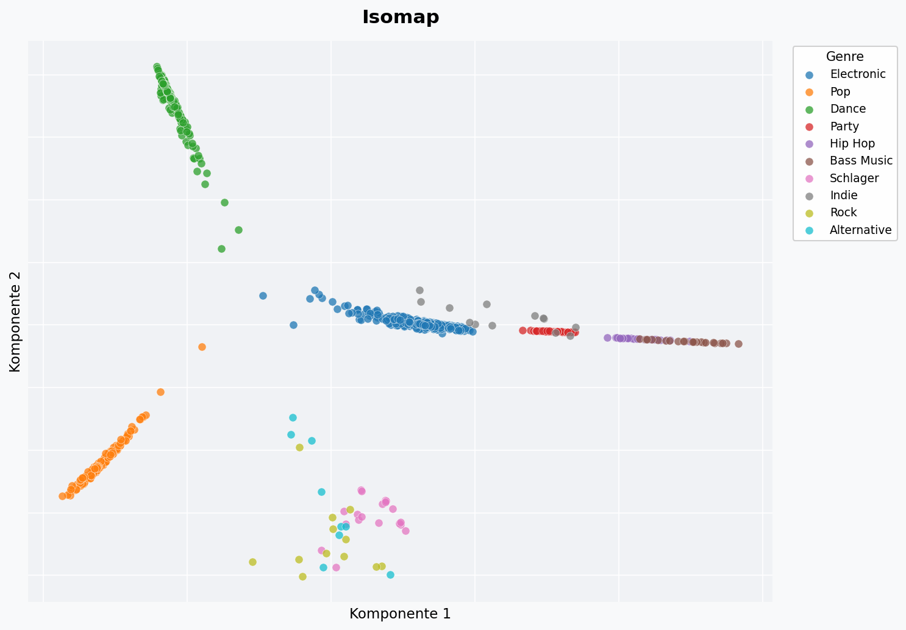

---

### Spectral Embedding

Spectral Embedding baut einen Ähnlichkeitsgraphen zwischen den Datenpunkten auf und berechnet daraus die Eigenvektoren der Laplace-Matrix.

**Laufzeit: 0.08s**

Das Ergebnis ist leider wenig aufschlussreich. Fast alle Genres werden in die untere linke Ecke gequetscht. Nur Dance (grün) wird weit nach rechts herausgezogen. Das ist ein bekanntes Problem von Spectral Embedding: Wenn ein Cluster intern sehr dicht verbunden ist (Dance mit 149 Songs ist der zweitgrößte), kann er das gesamte Embedding verzerren. Für diesen Datensatz ist die Methode deshalb eigentlich gar nicht geeignet.

  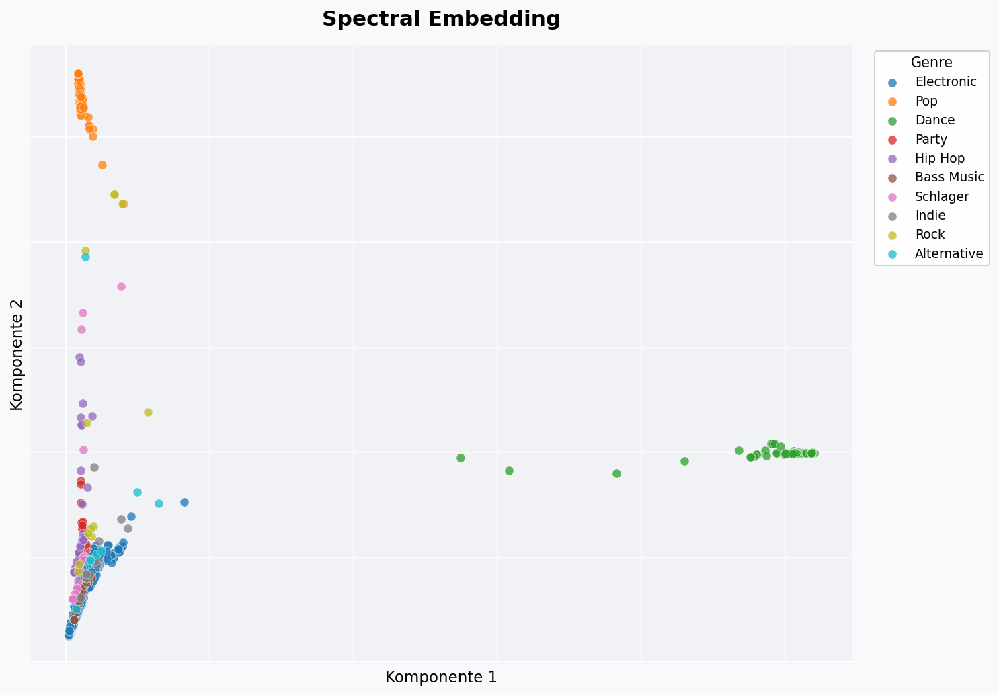

---

## Clustering

Beim Clustering werden Songs automatisch in Gruppen eingeteilt. Als Eingabe dienen dieselben Features wie bei der Dimensionsreduktion (Genre, Jahr, Länge). Die Visualisierung erfolgt jeweils über eine PCA-Projektion auf 2D. Zur Bewertung der Clusterqualität wird der **Silhouette-Score** verwendet.
Da die Daten bereits komplett gelabeled sind, sind die Erkenntnisse nicht wirklich neu, aber dieses Projekt hat mir einen besseren Überblick über die einzelnen Methoden geliefert und welche Grenzen welche Methoden haben.

### KMeans

KMeans teilt die Daten in eine vorher festgelegte Anzahl von Clustern (hier k=7). Der Algorithmus minimiert iterativ die Abstände der Punkte zu ihrem jeweiligen Clusterzentrum.

**Silhouette-Score: 0.457** | **Laufzeit: 1.53s**

Der beste Silhouette Score wäre bei k=10, was intuitiv Sinn macht, da es auch 10 Genres gibt. Allerdings gibt es auch hier keine neuen Informationen.

  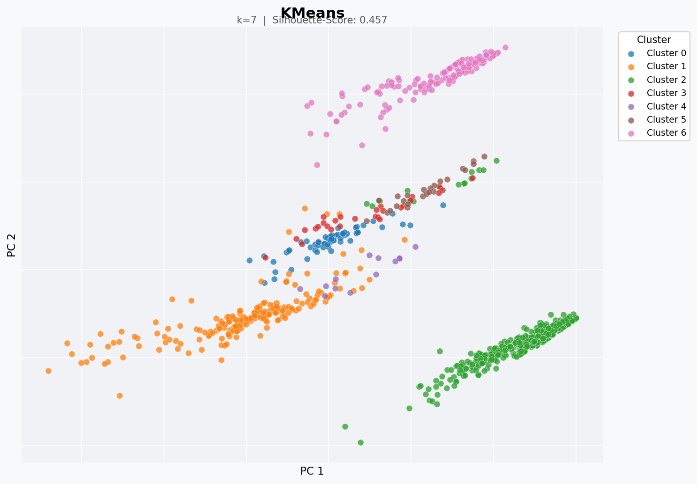

---

### MeanShift

MeanShift benötigt keine vorgegebene Clusteranzahl. Der Algorithmus verschiebt iterativ Kernelpunkte in Richtung der lokalen Datendichte und findet so eigenständig die Anzahl der Cluster. Hier wurden automatisch **11 Cluster** erkannt. Auch hier entspricht die Anzahl der Cluster etwa der Anzahl von Genres.

**Silhouette-Score: 0.403** | **Laufzeit: 0.18s**

  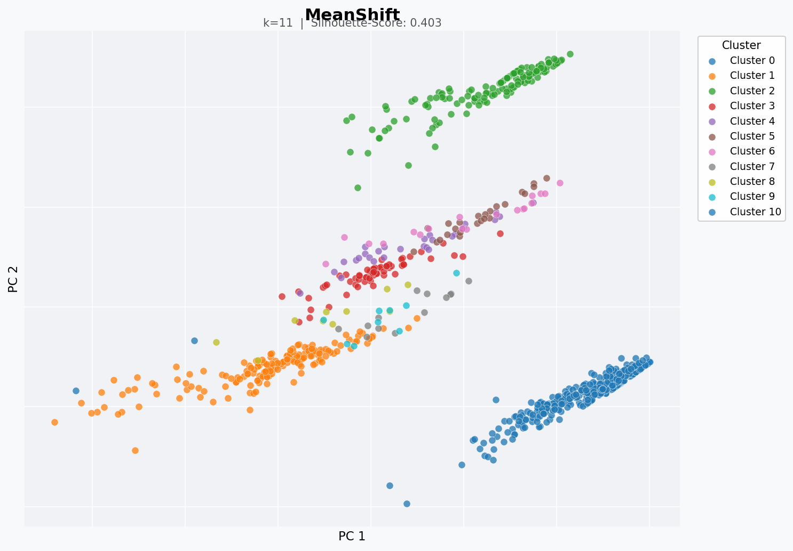

---

### Gaussian Mixture Model

GMM geht davon aus, dass die Daten durch eine Überlagerung mehrerer Normalverteilungen (Gaussians) erzeugt wurden. Im Gegensatz zu KMeans weist GMM jedem Punkt keine harte Clusterzugehörigkeit zu, sondern eine Wahrscheinlichkeit, sodass ein Punkt nahe an einer Clustergrenze kann also "ein bisschen" zu beiden gehören kann.

Das Ergebnis sieht KMeans allerdings sehr ähnlich, was für diesen Datensatz nicht überrascht: Die Genres bilden bereits klar getrennte Gruppen, sodass die Wahrscheinlichkeitsnuancen kaum einen Unterschied machen. Der leicht niedrigere Silhouette-Score (0.399 vs. 0.457) zeigt sogar, dass KMeans die kompakteren Cluster findet. GMM wäre hier erst dann im Vorteil, wenn die Cluster stark überlappen würden.

**Silhouette-Score: 0.399** | **Laufzeit: 0.10s**

  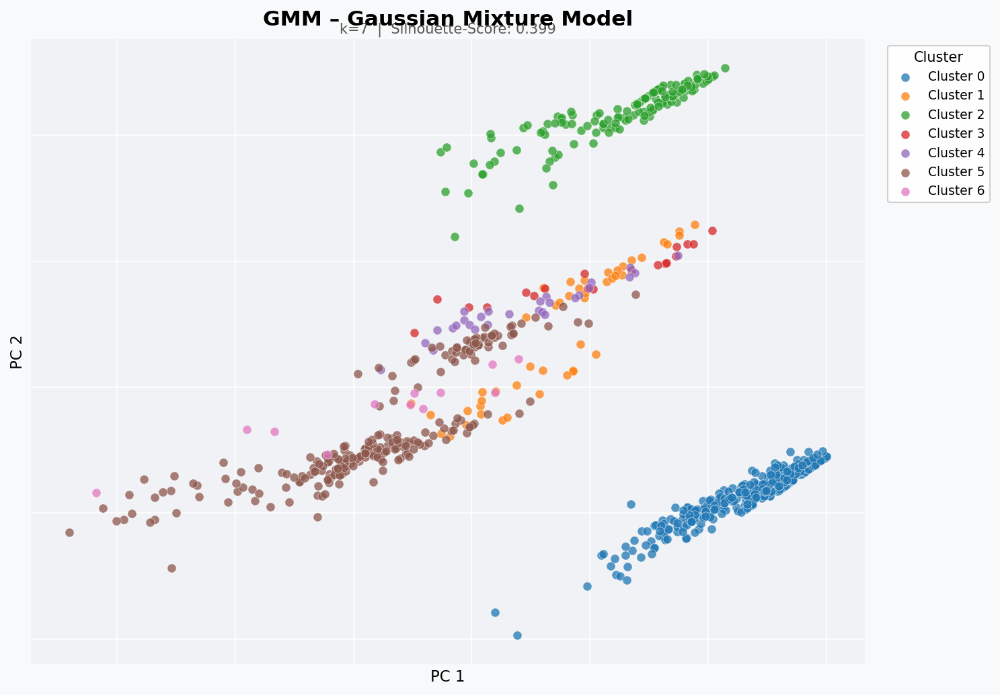

---

### Spectral Clustering

Spectral Clustering baut zunächst einen Ähnlichkeitsgraphen zwischen den Datenpunkten auf und wendet anschließend Clustering auf die Eigenvektoren der Graph-Laplace-Matrix an.

Das Ergebnis erklärt auch den niedrigen Silhouette-Score, da Cluster 1 (orange) gleichzeitig in der Mitte des Plots und unten rechts auftaucht. Das bedeutet, der Algorithmus hat Songs zusammengefasst, die sich eigentlich nicht ähneln. Spectral Clustering optimiert Graphschnitte, keine geometrische Nähe, und das führt hier zu Clustern, die quer durch die natürlichen Genre-Grenzen laufen. Für einen Datensatz mit so klar trennbaren Gruppen wie diesem ist das ein Nachteil. 

**Silhouette-Score: 0.102** | **Laufzeit: 0.13s**

  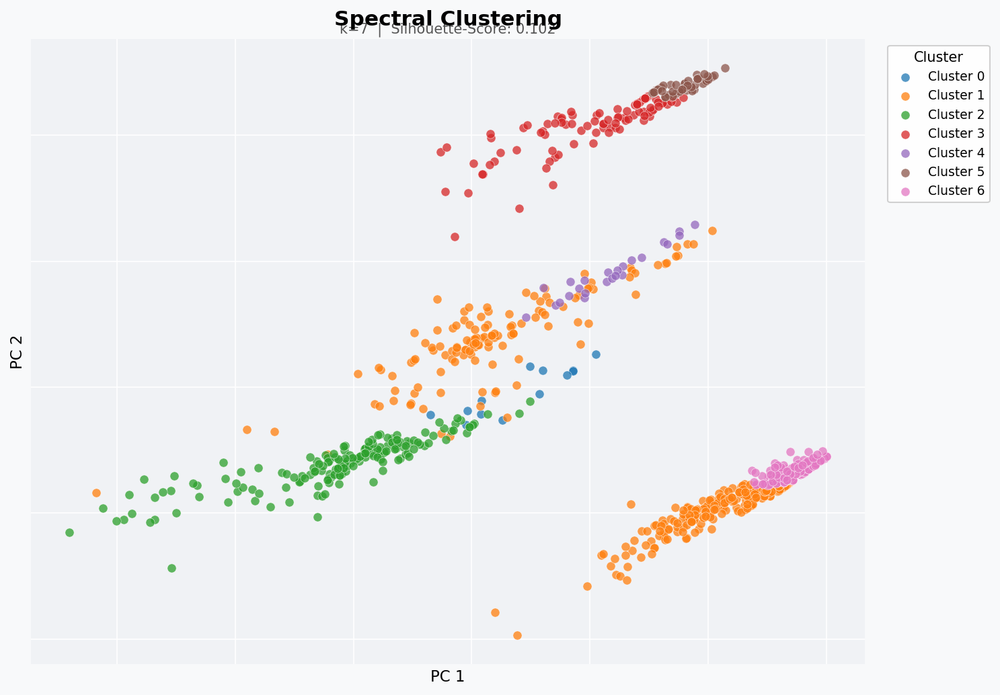

---

## Klassifikation

Ziel: Genre eines Songs aus **Erscheinungsjahr und Länge** vorhersagen. Die Daten wurden 80/20 in Trainings- und Testset aufgeteilt (stratifiziert nach Genre). Da die Klassen stark unbalanciert sind (Electronic: 339 Songs, Alternative: 9), wurden alle Modelle mit `class_weight="balanced"` trainiert.

**Was ist der F1-Score?**
Der F1-Score ist das harmonische Mittel aus zwei Metriken: *Precision* (wie viele der als „Electronic" vorhergesagten Songs sind wirklich Electronic?) und *Recall* (wie viele der echten Electronic-Songs hat das Modell erkannt?). Er liegt zwischen 0 und 1. Der **Macro F1** berechnet den F1 für jedes Genre einzeln und mittelt dann. Ein Modell, das einfach immer „Electronic" vorhersagt, würde ~41% Accuracy erreichen, was erstmal ok klingt, aber relativ nutzlos ist, weil eben gar nicht wirklich versucht wird etwas vorherzusagen.

### Modellvergleich - Macro F1

SVC rbf (0.227) und Random Forest (0.219) schneiden am besten ab, Linear SVC (0.164) am schlechtesten. Der Unterschied zwischen den Modellen ist aber gering; alle liegen zwischen 0.16 und 0.23. Das zeigt, dass das Bottleneck nicht der Algorithmus ist, sondern die Features: Wenn Jahr und Länge allein Genre nicht erklären können, hilft auch ein besseres Modell nicht weiter.

  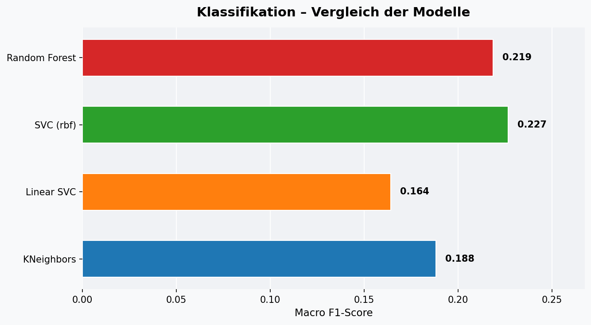

---

### KNeighbors Classifier

KNN klassifiziert einen Punkt anhand der k nächsten Nachbarn im Feature-Raum. Hier k=7.

**Macro F1: 0.188** | **Laufzeit: 0.01s**

Electronic (85%) und Pop (72%) werden noch relativ gut erkannt. Dance hingegen wird zu 53% als Electronic klassifiziert; das macht Sinn, weil Dance-Songs im Feature-Raum (Jahr + Länge) sehr nah an Electronic liegen. Auf der anderen Seite werden kleine Genres wie Bass Music, Indie und Alternative zu 100% als Electronic vorhergesagt, was daran liegt, dass das Modell in ihrer Nachbarschaft fast nur Electronic-Songs findet, weil die Klasse so dominant ist.

  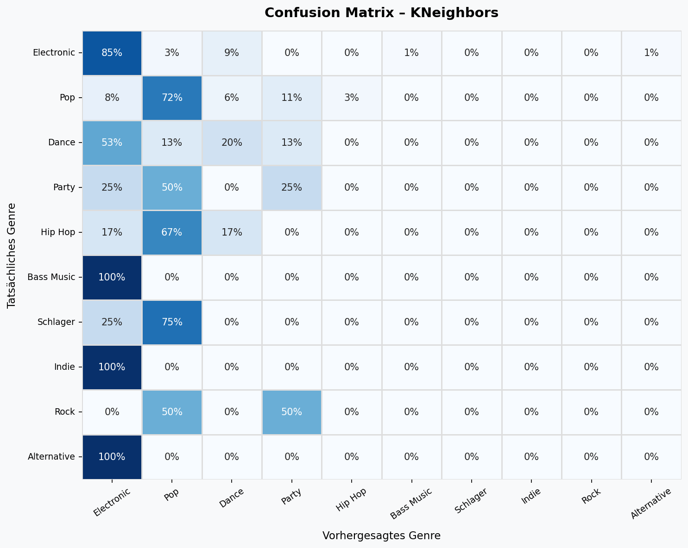

---

### Linear SVC

Der Linear Support Vector Classifier sucht eine lineare Trennhyperplane zwischen den Klassen. Er ist effizient und gut für hochdimensionale Räume geeignet. Mit nur zwei Features (Jahr, Länge) stößt er hier an seine Grenzen.

**Macro F1: 0.164** | **Laufzeit: 0.01s**

Das Modell ist stark auf Electronic (91%) und Pop (89%) spezialisiert. Dance wird zu 73% als Electronic vorhergesagt. Das liegt daran, dass eine lineare Trennlinie bei nur zwei Features keine feine Unterscheidung zwischen ähnlichen Genres ermöglicht. Der niedrigste Macro F1 (0.164) der vier Modelle spiegelt das wider.

  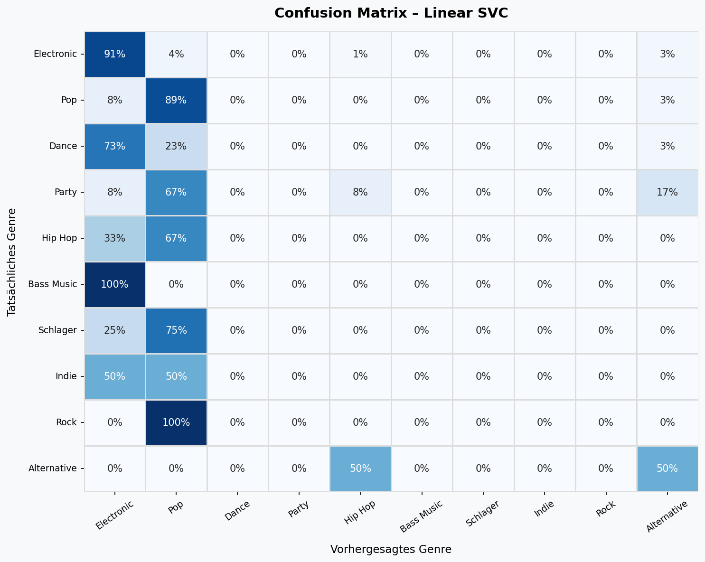

---

### SVC (kernel='rbf')

Der SVC mit RBF-Kernel kann nicht-lineare Entscheidungsgrenzen lernen. Das macht ihn flexibler als den linearen SVC, führt aber bei wenigen Features nicht zwingend zu besseren Ergebnissen.

**Macro F1: 0.227** | **Laufzeit: 0.04s**

Die Ergebnisse sind die unberechenbarsten der vier Modelle. Electronic wird nur zu 40% korrekt erkannt, aber dafür wird Bass Music zu 100% richtig klassifiziert. Rock wird zu 100% als Party vorhergesagt. Der rbf-Kernel hat offenbar sehr ungewöhnliche nicht-lineare Grenzen gelernt, die mit der echten Struktur der Daten wenig zu tun haben. Trotzdem erreicht er mit 0.227 den höchsten Macro F1, weil er bei einigen kleinen Klassen besser abschneidet als die anderen Modelle.

  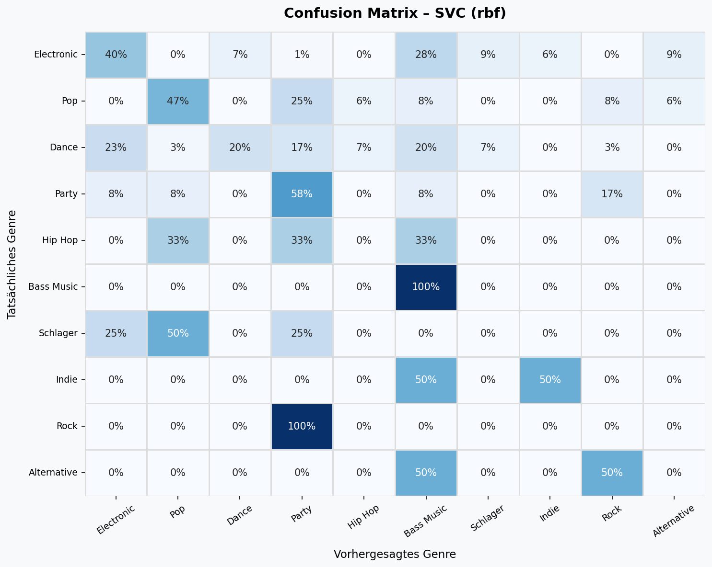

---

### Random Forest

Random Forest trainiert eine Vielzahl von Entscheidungsbäumen auf zufälligen Teilmengen der Daten und mittelt deren Vorhersagen. Zusätzlich zur Confusion Matrix liefert er Feature Importances, die aufzeigen welche der beiden Features (Jahr vs. Länge) mehr zur Klassifikation beiträgt.

**Macro F1: 0.219** | **Laufzeit: 0.47s**

Das Ergebnis ist ähnlich wie bei KNN: Electronic (74%) und Pop (69%) werden am besten erkannt, Dance landet zu 40% fälschlicherweise bei Electronic. Alternative wird wieder zu 100% als Electronic eingestuft. Der Vorteil des Random Forest zeigt sich weniger in den Confusion-Matrix-Werten als in der Feature-Importance-Grafik, da sie zeigt, wie das Modell seine Entscheidungen trifft.

  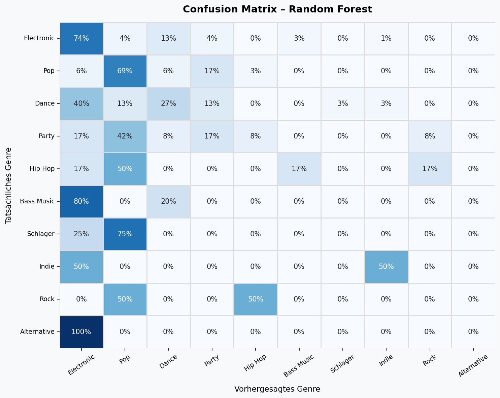

  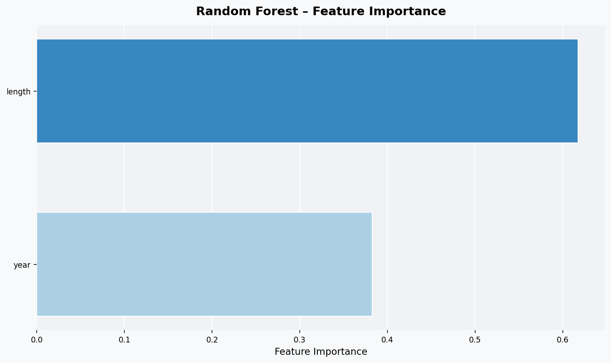

---

